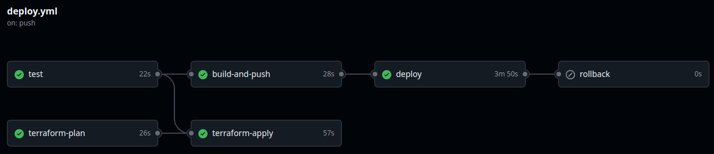

# AWS Elastic Container Service / GitHub Actions / Terraform / CloudWatch

📋 Project Overview
This project demonstrates a complete DevOps pipeline for deploying a Python FastAPI application to AWS ECS using Infrastructure as Code (Terraform) and CI/CD (GitHub Actions). The solution includes automated testing, security monitoring, and rollback capabilities.

## 🏗️ Architecture Overview

### Infrastructure Design
```
Internet → ALB (Public) → ECS Fargate (Private Subnets) → FastAPI Application
                             ↓
                     CloudWatch Monitoring
                             ↓
                    GitHub Actions CI/CD
```

### Key Components

* VPC: Multi-AZ architecture with public and private subnets
* ECS Fargate: Serverless containers running in private subnets
* ALB: Application Load Balancer for traffic distribution and SSL termination
* ECR: Private Docker registry for container images
* CloudWatch: Comprehensive monitoring, logging, and alerting
* GitHub Actions: Automated CI/CD pipeline with testing and deployment

### Key Design Decisions

1. Fargate over EC2: Reduced operational overhead, automatic scaling
2. Private Subnets for ECS: Enhanced security by isolating containers
3. Multi-AZ Deployment: High availability across availability zones
4. Git SHA Tagging: Immutable deployments and precise rollback capability
5. Infrastructure as Code: Complete environment reproducibility

## 📋 Prerequisites

### AWS Setup

1. AWS Account with appropriate permissions
2. IAM User with programmatic access for Terraform
3. AWS CLI configured with your profile

### Local Development

* Terraform >= 1.0
* Docker
* Python 3.11+
* AWS CLI

### GitHub Repository

* Repository secrets configured:
    * AWS_ACCESS_KEY_ID
    * AWS_SECRET_ACCESS_KEY

## 🚀 Deployment Instructions

### Manual Deployment

1. Clone and Setup

    ```
    git clone https://github.com/QIRoss/ECS-GitHub-Actions-Terraform-CloudWatch
    cd ecs-githubactions-terraform-cloudwatch
    ```

2. Use first_deploy.sh Script

    ```
    ./first_deploy.sh
    ```

## 🎯 Testing the Application

After deployment, test the endpoints:

```
# Get ALB URL from Terraform outputs
ALB_URL=$(terraform output -raw alb_dns_name)

# Test health endpoint
curl http://$ALB_URL/health

# Test API endpoint
curl http://$ALB_URL/api/hello
```

### Automated Deployment (CI/CD)

* Push to master branch triggers automated pipeline
* Pipeline includes: testing → Terraform plan → build → deploy → verify

## 🔄 CI/CD Flow



### Pipeline Stages
1. Test: Code quality checks, linting, and unit tests
2. Terraform Plan: Infrastructure change preview
3. Build: Docker image build and push to ECR
4. Terraform Apply: Apply infrastructure changes
5. Deploy: Automated deployment to ECS Fargate
6. Rollback: Automatic rollback on deployment failure

### Trigger Conditions

1. Push to Master: Full deployment pipeline
2. Failure: Automatic rollback to previous version


## 🔒 Security Considerations

### Implemented Security Measures

* Network Security: ECS tasks in private subnets, strict security groups
* IAM Least Privilege: Minimal permissions for ECS tasks and GitHub Actions
* Encryption: ECR image encryption, S3 bucket encryption
* Secrets Management: No hardcoded credentials, GitHub Secrets for sensitive data
* Container Security: Regular base image updates, no root user in containers

### Production Enhancements (not implemented)

* AWS WAF for web application firewall
* Secrets Manager for application secrets
* Container vulnerability scanning in pipeline
* VPC Flow Logs for network monitoring
* SSL/TLS certificates with ACM

## 🛠️ Technical Implementation

### Application

* FastAPI Python web framework
* Health check endpoint for load balancer
* Environment-based configuration
* Containerized with Docker

### Infrastructure (Terraform)

* Modular Terraform code
* Remote state management with S3 and DynamoDB locking
* Configurable variables for different environments
* Comprehensive CloudWatch monitoring and alerts

### Monitoring & Alerting (CloudWatch and SNS)

* CPU/Memory utilization alarms
* ALB 5xx error monitoring
* Application error tracking via CloudWatch Logs
* SNS notifications for critical alerts

## 📊 Monitoring & Observability

### Real-time Monitoring

- **CloudWatch Dashboard**: CPU, memory, request count, and error rates
- **Application Metrics**: Response times and custom business metrics
- **Log Analysis**: Structured logging with CloudWatch Logs Insights

### Alerting Thresholds
- CPU Utilization: >80% for 5 minutes
- Memory Utilization: >80% for 5 minutes  
- 5xx Errors: >5 errors in 10 minutes
- Health Check Failures: Immediate alerting

### Accessing Metrics and Logs

```
# Access Application Logs
aws logs get-log-events \
  --log-group-name "/ecs/eloquent-ai-app" \
  --log-stream-name "$(aws logs describe-log-streams --log-group-name "/ecs/eloquent-ai-app" --region us-east-1 --order-by LastEventTime --descending --query 'logStreams[0].logStreamName' --output text)" \
  --region us-east-1 \
  --limit 10 \
  --query 'events[*].[timestamp, message]' \
  --output text | while read ts msg; do 
    echo "$(date -d "@$(($ts/1000))" "+%H:%M:%S") - $msg"; 
done
```


```
# View CloudWatch Dashboard
aws cloudwatch get-dashboard --dashboard-name eloquent-ai-app-dashboard

# Check recent errors
aws logs filter-log-events --log-group-name /ecs/eloquent-ai-app --filter-pattern "ERROR"

```

## 🧹 Cleanup

To destroy all resources:

```
cd terraform
terraform destroy
```

Resources outside Terraform that you should remove manually:

1. S3 Bucket with tfstate backend
2. DynamoDB table witth tfstate lock

## 🐛 Troubleshooting Guide

### Common Issues

#### Deployment Failures
```
# Check ECS service events
aws ecs describe-services --cluster eloquent-ai-app-cluster --services eloquent-ai-app-service

# View task failures
aws ecs describe-tasks --cluster eloquent-ai-app-cluster --tasks <task-arn>
```

#### Application Issues

```
# Get container logs
aws logs get-log-events --log-group-name /ecs/eloquent-ai-app --log-stream-name <stream-name>

# Test ALB health checks
curl -v http://<alb-url>/health
```

#### Infrastructure Issues

```
# Check Terraform state
terraform state list

# Verify S3 backend
aws s3 ls s3://eloquent-ai-app-tfstate/
```

## 💰 Cost Optimization

### Current Estimated Costs
- **ECS Fargate**: ~$10-15/month
- **ALB**: ~$18/month  
- **NAT Gateway**: ~$32/month
- **CloudWatch**: ~$5-10/month
- **Total**: ~$65-75/month

### Cost Saving Tips
1. **Remove NAT Gateway** for development (saves ~$32/month)
2. **Reduce Fargate CPU** to 0.25 vCPU for non-production
3. **Implement auto-scaling** to scale to zero during off-hours
4. **Use Spot Instances** for development environments

### Performance Benchmarks

- Cold Start: ~15-30 seconds
- Request Latency: <100ms
- Concurrent Connections: Tested up to 1000 RPM

## 📈 Design Decisions & Trade-offs

### Decisions Made

1. Fargate over EC2: Faster setup but less infrastructure control
2. Rolling Deployment: Simpler implementation vs zero-downtime strategies
3. Terraform State in S3: Team collaboration vs added complexity
4. GitHub Actions: Native integration vs AWS CodePipeline
5. Project as close to a "one-click deployment" as possible with ```first_deploy.sh```. This script automatically creates the S3 bucket, enables versioning, and sets up the DynamoDB table for Terraform state locking (preventing concurrent terraform apply operations).

### Trade-offs Considered

* Cost vs. Availability: Multi-AZ increases cost but provides resilience
* Simplicity vs. Features: Chose simpler health checks over advanced deployment strategies
* Speed vs. Safety: Automated deployments vs manual approvals
* This design decision enabled simultaneous infrastructure updates and CI/CD pipeline execution, however needs to check variables from GitHub Actions deploy.yaml instead of tfvars.

### Future Improvements

1. IAM Refinement: Implement role-based access control for different user groups and refactor Terraform accordingly. Also create a rollback system integrated with observability (possibly using Prometheus).
2. Enhanced Monitoring: Add more variables for reliability and scalability tracking.
3. Secrets Management: Utilize AWS Secrets Manager/Systems Manager Parameter Store to centralize all configuration variables currently in tfvars and deploy.yml.
4. Network Architecture: Enhance VPC, Security Groups, and Subnets design to accommodate connections to other AWS services like S3, RDS, and DynamoDB.
5. Service Expansion: Expand the FastAPI service and implement additional AWS services like Lambda, EventBridge, and SQS.
6. Expand the FastAPI service and implement different types of services like AWS Lambda, EventBridge and SQS.
7. Pipeline Optimization: Split the current pipeline into two or three separate pipelines for PR feedback, development, and staging environments.
8. Security & Microservices: Add SSL certificates, HTTPS configuration, and implement additional microservices architecture patterns. Enhanced security scanning.
9. Multi-environment support (dev/staging/prod).
10. Infrastructure cost optimization.

## 📞 Support

For issues or questions:

1. Check GitHub Actions logs for deployment issues
2. Verify CloudWatch logs for application errors
3. Review Terraform plans for infrastructure changes
4. [Lucas de Queiroz on LinkedIn](https://www.linkedin.com/in/lucas-de-queiroz/)